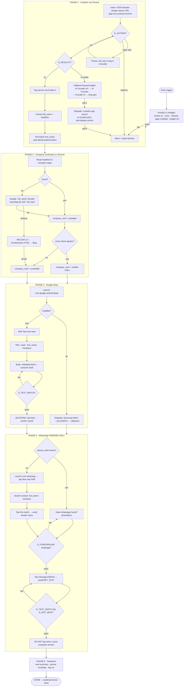

# SuperPowers AI Power Spec — `linkedin_lead_gen_outreach`

**Device target:** Android (Accessibility-tree automation + intent/deep-link dispatch)
**Build date:** 2026-10-05
**Status:** Ready for Power registration

---

## 0. Design Decisions (read this first — it changes the flow)

Three decisions were made that differ from the naive "tap LinkedIn app icon" approach. Each exists because it removes a whole class of failure.

| # | Decision | Why |
|---|---|---|
| **D1** | Run the LinkedIn step in **Chrome mobile-web LinkedIn**, not the LinkedIn Android app. | The app search flow is non-deterministic (suggested-entities rows, A/B layouts, no address bar, no re-entry URL). Mobile web is **URL-addressable**, so "go to search results" = one intent, retriable and idempotent. LinkedIn people-search URLs encode filters directly: `https://www.linkedin.com/search/results/people/?keywords=…&geoUrn=[…]`. |
| **D2** | Search keywords = `"AI" AND "Founder"`, **location filter = New York metro** — not the literal string `AI Founder New York`. | A literal `AI Founder New York` keyword search is fuzzy-matched against the whole profile and returns garbage. Location belongs in the geo filter, not the keyword box. This is the single highest-leverage fix for the "zero results" edge case. |
| **D3** | WhatsApp step **ends in "prepared", never sent.** Deep-link prefill first (`whatsapp://send?phone=…&text=…` / `https://wa.me/…`), contact-picker second. | Prefill via deep link skips 4 fragile taps. Never auto-sending is a hard safety rule (see §4.1). |

---

## 1. Config (all tunable, defaults shown)

```json
{
  "search_keywords": "\"AI\" AND \"Founder\"",
  "raw_query_intent": "AI Founder New York",
  "geo_label": "New York City Metropolitan Area",
  "geo_urn": "103644278",
  "result_index": 0,
  "result_backup_count": 2,
  "apps": {
    "browser_pkg": "com.android.chrome",
    "linkedin_pkg": "com.linkedin.android",
    "keep_pkg": "com.google.android.keep",
    "whatsapp_pkg": "com.whatsapp"
  },
  "timeouts_ms": { "soft_page": 8000, "hard_page": 12000, "action_settle": 1200, "global_run": 300000 },
  "budgets": { "max_total_actions": 120, "max_retries_per_step": 3, "max_app_reanchors": 3, "max_source_tiers": 3 },
  "verification_required": true,
  "auto_send": false
}
```

---

## 2. The Architecture (the part that prevents "getting lost")

Four primitives. Every step in the flowchart below is an instance of these.

### 2.1 State Envelope
One JSON object carried through the entire run. It is the **only** source of truth. The agent never infers progress from the screen — it reads progress from the envelope, then uses the screen only to confirm it.

```json
{
  "run_id": "lg-20261005-001",
  "phase": "P1_LINKEDIN",
  "step": "P1.7",
  "retry": { "step_retries": 0, "reanchors": 0, "actions_used": 14, "t_start_ms": 0 },
  "lead": {
    "full_name": null, "first_name": null, "headline": null,
    "profile_url": null, "company": null,
    "company_verification": { "status": "unknown", "confidence": 0.0, "source": null, "quote": null },
    "phone_e164": null
  },
  "message": { "text": null, "keep_note_title": null, "keep_saved": false },
  "wa": { "chat_open": false, "prefilled": false, "send_armed": false },
  "fallbacks_used": [],
  "blockers": [],
  "outcome": "in_progress"
}
```

### 2.2 The Operating Loop (every single action)
```
LOOP FOREVER (until DONE or HARD STOP):
  1. PERCEIVE  → screenshot + accessibility tree + foreground package/activity
  2. LOCATE    → find target node by (content-desc | text | resource-id) in that priority order
  3. ASSERT    → does the pre-condition gate hold?  NO → go to RECOVERY, do not act blind
  4. ACT       → exactly one action (tap | swipe | input | intent | wait)
  5. SETTLE    → wait action_settle (1200ms) or until tree diff is stable
  6. VERIFY    → post-condition gate. PASS → write state, advance step.
                                       FAIL → increment retry, go to RECOVERY
  7. BUDGET    → actions_used++ ; breach → HARD STOP
```

### 2.3 Assertion Gates
A gate is a boolean predicate that must be true **before** an action is allowed. No gate, no action. This is what stops blind tapping.

| Gate | Predicate |
|---|---|
| `G_FOREGROUND` | `foreground_pkg == expected_pkg` |
| `G_LOADED` | page has ≥1 content node AND no progress spinner older than `hard_page` |
| `G_AUTHED` | no login wall / "Sign in" gate in tree |
| `G_NOT_CAPTCHA` | no captcha/challenge/unusual-traffic node present |
| `G_RESULTS` | ≥1 person-card node present OR an explicit empty-state node present |
| `G_FIELD_EDITABLE` | target EditText is `enabled && focused` |
| `G_TEXT_MATCH` | field text == intended text (after whitespace normalization) |
| `G_NOT_SENT` | WhatsApp composer still contains the draft (message is NOT in the transcript) |

### 2.4 The Universal Recovery Ladder
Identical for every failure. Escalate one rung at a time; never jump.

| Rung | Action | Applies to |
|---|---|---|
| **L0 Re-perceive** | New screenshot + tree. ~40% of "failures" are a stale snapshot. | all |
| **L1 Backoff-retry** | Wait 1.5s → 3s → 5s, re-assert gate, retry same action. Max `max_retries_per_step`. | transient |
| **L2 Re-anchor** | `HOME` → relaunch phase app by **explicit intent** → re-assert `G_FOREGROUND`. Max 3. | lost / wrong app |
| **L3 Degrade** | Switch to the documented alternative path for this phase (fallback source, fallback app, fallback input method). | hard failure |
| **L4 Human hand-off** | Pause, surface blocker + screenshot + resume instructions, keep state. | unrecoverable |
| **L5 Abort** | Write partial envelope, stop cleanly. Never leave the device in an unknown state. | terminal |

---

## 3. Logical Flowchart — every click, swipe, and input

### 3.1 Visual



### 3.2 Step table (the executable detail)

Notation: `TAP(node)`, `SWIPE(dir,dist)`, `INPUT(node,text)`, `INTENT(uri)`, `WAIT(ms)`, `READ(node)`.
Selector priority is always **content-desc → text → resource-id** (content-desc/text survive app updates better than ids).

#### PHASE 0 — Preflight
| Step | Action | Gate | On fail |
|---|---|---|---|
| 0.1 | `INTENT(SCREEN_ON)` / wake; if `KEYGUARD` present → **L4 human** | screen on, unlocked | L4 |
| 0.2 | `READ(pkg)` foreground | — | record baseline app |
| 0.3 | Probe network (any page reachable) | online | L4 |
| 0.4 | Resolve packages: chrome, keep, whatsapp | ≥1 browser + whatsapp present | L3 per-app fallback |
| 0.5 | Init state envelope, `actions_used=0`, `t_start=now` | — | — |
| 0.6 | Dismiss overlays: notification shade, system dialogs ("Open in app?", "Allow?") → `TAP(Close/Cancel/Not now)` | none blocking | 1 retry then proceed |

#### PHASE 1 — LinkedIn people search (Chrome mobile web)
| Step | Action | Gate | On fail |
|---|---|---|---|
| 1.1 | `INTENT(VIEW, "https://www.linkedin.com/search/results/people/?keywords=%22AI%22%20AND%20%22Founder%22&geoUrn=%5B%22103644278%22%5D&origin=FACETED_SEARCH", pkg=com.android.chrome, NEW_TASK)` | — | L2 |
| 1.2 | `WAIT(soft_page=8000)` then poll tree every 500ms to `hard_page=12000` | `G_LOADED` | L1 → L3 (reload) |
| 1.3 | Detect auth: node text ∈ {Sign in, Join now, Log in} as page-level CTA | `G_AUTHED` | **L4**: "Please sign in to LinkedIn in Chrome, then say 'continue'" — do **not** enter credentials |
| 1.4 | Detect challenge: text ∈ {checkpoint, unusual activity, security check, verify} | `G_NOT_CAPTCHA` | **L5 abort** (never solve captchas) |
| 1.5 | Detect empty state: text ∈ {No results found, Try adjusting, no results match} | `G_RESULTS` | → **1.10 keyword ladder** |
| 1.6 | If entity tabs shown and active ≠ People → `TAP(tab "People")`; `WAIT(settle)` | active tab == People | L1 |
| 1.7 | Enumerate person cards. `results_n = count(cards)`. If `results_n < 3` → `SWIPE(up, 60%)` once and re-count | `results_n ≥ 1` | 1.10 |
| 1.8 | `READ(card[0].name)` → `full_name`; `READ(card[0].subtitle)` → `headline`; capture `profile_url` (card node link or via long-press → copy link) | `full_name` non-empty | L1 → skip to card[1] |
| 1.9 | Derive `first_name`: split on whitespace; strip leading honorifics `{Dr., Mr., Ms., Mrs., Prof., Ir.}` and trailing credentials `{MBA, PhD}`; strip emoji and any parenthetical pronouns `(he/him)`; keep only letters, `-`, `'`. **VALID if length ≥ 1 (CJK names are legitimately 1 char) AND ≥ 1 alphabetic char.** A bare single Latin initial (e.g. `A. Johnson`) is invalid → fall through to card[1], then card[2] | `first_name` valid | 1.10 |
| 1.10 | **Keyword ladder** (one rung, full page reload each): `① "AI" AND "Founder" + geo` → `② "AI Founder" + geo` → `③ "Founder" + "artificial intelligence" + geo` → `④ "AI Founder"` (geo dropped) → `⑤ app fallback`: launch `com.linkedin.android`, `TAP(search)`, `INPUT("AI Founder")`, `TAP(Send)`, `TAP(People)`, `TAP(Filters)` → `INPUT(Location,"New York")`, `TAP(Show results)` → `⑥ browser fallback`: `https://duckduckgo.com/?q=%22AI+founder%22+%22New+York%22+site%3Alinkedin.com%2Fin` | ≥1 result | after ⑥ → **L5 abort** |
| 1.11 | `TAP(back)` to results list; **persist `results_snapshot` (name + url of cards 0..2)** | — | — |

> **Note 1.11:** capturing cards 0..2 is deliberate. If card[0] later yields an unusable name, an unparseable company, or a dead profile, we advance to card[1] instead of restarting Phase 1.

#### PHASE 2 — Company verification (Chrome)
| Step | Action | Gate | On fail |
|---|---|---|---|
| 2.1 | **Tier 0 (free):** run the verified role/company regex from the Power Prompt (P2.1) over `headline`, then apply post-processing steps (a)→(d) | match | Tier 1 |
| 2.2 | Open new tab: `INTENT(VIEW, "https://www.google.com/search?q=%22{full_name}%22+founder+linkedin", pkg=chrome)` | `G_LOADED` within watchdog | **2.3** |
| 2.3 | **Watchdog ladder:** 8s soft → 12s hard → `TAP(reload)` + 8s → `TAP(reload)` + 8s → degrade to `https://duckduckgo.com/html/?q=…` → degrade to `https://www.bing.com/search?q=…` | any source renders | mark `unverified`, **continue** |
| 2.4 | `READ(top result snippet + title)`; extract company with the same regex family plus `"is the founder of X"`, `"X — Founder"`, `"Founder @ X"` | candidate found | `unverified` |
| 2.5 | Cross-check candidate vs Tier-0 headline. Same → `verified, conf 0.9`. Different but plausible → `probable, conf 0.6` + `conflict_note`. | — | — |
| 2.6 | Set `lead.company` (or `null`) and `company_verification` block. **Phase 2 never blocks the pipeline** — an unverified company only changes the message template. | — | — |

> **Critical:** slow/failed verification must **degrade, not abort**. A lead with `company = null` still gets an outreach draft; the template simply switches to a company-agnostic opener (see §7.3).

#### PHASE 3 — Google Keep (draft the message)
| Step | Action | Gate | On fail |
|---|---|---|---|
| 3.1 | `INTENT(launch com.google.android.keep)` | `G_FOREGROUND` keep | L2 → **L3**: Samsung Notes (`com.samsung.android.app.notes`) → any `EditText`-bearing app → clipboard + `TAP(toast)` |
| 3.2 | Idempotency check: scan note titles for `Lead · {first_name}`. Found → open it, don't create a duplicate | — | — |
| 3.3 | `TAP(content-desc "New text note")` (alt: text `Take a note` → `Note`) | composer open | L1 |
| 3.4 | `TAP(field "Title")` → `INPUT("Lead · {first_name} · {company or 'Co. unverified'}")` | `G_FIELD_EDITABLE` | L1 |
| 3.5 | `TAP(field "Note")` → `INPUT(§7.3 body)` | `G_FIELD_EDITABLE` | L1 |
| 3.6 | `READ(note body)`; normalize whitespace; compare to intended | `G_TEXT_MATCH` | re-`INPUT` once → then clipboard-paste path (`LONG_PRESS` → `Paste`) |
| 3.7 | **Persistence gate:** `TAP(back)` and `WAIT(1500)`; re-open note list, confirm title present. Keep saves on back-navigation — verifying this is mandatory, not optional | `keep_saved == true` | retry 3.7 once → **L4** |

#### PHASE 4 — WhatsApp (prepare, never send)
| Step | Action | Gate | On fail |
|---|---|---|---|
| 4.1 | If `phone_e164` known → `INTENT(VIEW, "whatsapp://send?phone={digits}&text={urlencode(msg)}", pkg=com.whatsapp, NEW_TASK)`. Else skip to 4.3 | — | 4.3 |
| 4.2 | `WAIT(settle)`; if the `wa.me`/api interstitial appears → `TAP("Continue to Chat")` | `G_FOREGROUND whatsapp` | 4.3 |
| 4.3 | `INTENT(launch com.whatsapp)` → if onboarding/"Agree and continue" → **L4 human** (never accept ToS on the user's behalf) | home/chat list visible | L2 |
| 4.4 | `TAP(content-desc "New chat")` | picker opens | L1 |
| 4.5 | `TAP(search icon content-desc "Search")` → `INPUT("{full_name}")`; if 0 hits → retry with `{first_name}`, then `{company}` | ≥1 contact | **L4**: "No WhatsApp contact matched {full_name}. Pick the contact and say 'continue'" |
| 4.6 | `TAP(match[0])`; `READ(chat header title)`; require fuzzy-match ≥ 0.6 with `full_name` | header matches | back out, try match[1] → L4 |
| 4.7 | If header indicates a **group** (subtitle contains member count / "Group") → **do not** draft; `L4` | not a group | L4 |
| 4.8 | `TAP(field content-desc "Message")` → `INPUT(msg)` (fallback: `LONG_PRESS` → `Paste` from clipboard seeded in 3.6) | `G_FIELD_EDITABLE` | L1 |
| 4.9 | `READ(composer text)` == intended | `G_TEXT_MATCH` | re-input once → clipboard path → L4 |
| 4.10 | **`G_NOT_SENT`**: confirm the draft is in the composer and **not** in the transcript. **DO NOT TAP SEND.** Leave keyboard/composer visible | draft present | — |
| 4.11 | Set `wa.send_armed = true`, `outcome = "ready_for_human_send"` | — | — |

#### PHASE 5 — Teardown
| Step | Action |
|---|---|
| 5.1 | Do **not** background WhatsApp (the human needs it in front). Emit the summary as a speech + on-screen toast. |
| 5.2 | Persist the final envelope to device log; append to run history (for de-dup across runs). |
| 5.3 | Emit `RUN SUMMARY` (§7.4). |

---

## 4. Edge Cases — Iterative Refinement

### 4.1 The three questions, answered

#### Q1 — "What if the LinkedIn search returns no results?"
**Root causes, in descending frequency:** (a) location baked into the keyword string, (b) over-quoted boolean, (c) logged out / limited results, (d) genuinely empty segment.

**Refined logic:** a 6-rung keyword ladder (step 1.10) that degrades from *most precise* to *broadest*, plus two independent retrieval channels (app, external search engine) before abort. Every rung re-runs the whole `PERCEIVE→ACT→VERIFY` loop, so a mid-ladder success is indistinguishable from a first-try success to the rest of the pipeline. Abort only after rung ⑥, and even then the envelope is written so the next run can start one rung looser.

**Design rule:** *the ladder changes only the query, never the extraction contract.* Everything after step 1.10 assumes only "there is ≥1 person card".

#### Q2 — "What if the Chrome page takes too long to load?"
**Two distinct failures get conflated:** *slow* and *dead*. The spec separates them.

- **Soft watchdog (8s):** page not settled. Action: nothing — keep polling the tree every 500ms.
- **Hard watchdog (12s):** action begins. Rung ladder: `reload → wait 8s → reload → wait 8s → DuckDuckGo HTML (lightweight, no JS-heavy render) → Bing`.
- **Progress spinner still animating at 12s** ⇒ network-limited, not blocked ⇒ escalate source tier.
- **Error page (`ERR_`, `DNS`, "No internet")** ⇒ skip the wait entirely, jump straight to the next source tier.
- **Terminal:** if all tiers fail, Phase 2 records `company_verification.status = "unverified"`, the pipeline **continues** to Phase 3 with the company-agnostic template, and the summary flags it. A missing company is a *quality* problem, never a *pipeline* problem.

**Anti-pattern explicitly banned:** re-tapping the search box, re-navigating from home, or "waiting longer" indefinitely. Timeouts are numeric and bounded.

#### Q3 — "How do we ensure the agent doesn't get lost between app switches?"
Five layered defenses, cheapest first:

1. **Intent-first navigation.** Every app entry is an explicit `startActivity` with a target package — never "find the icon on the home screen". Deep links carry the *payload* (`whatsapp://send?phone=…&text=…`), so a whole chain of taps collapses into one atomic, retriable action.
2. **`G_FOREGROUND` gate before every action.** The agent literally cannot tap into the wrong app, because the gate fails first and routes to recovery.
3. **Re-anchor, don't backtrack.** When foreground ≠ expected: `HOME` → relaunch by intent → re-assert. Never "swipe back until it looks right" (that's how agents wander into a stale WhatsApp chat).
4. **State lives in the envelope, not the screen.** After a re-anchor the agent re-reads its phase from JSON and resumes at the exact step — no re-derivation from pixels.
5. **Re-entry URLs.** Because Phase 1/2 use Chrome URLs, "getting lost in the browser" is recoverable by re-firing the same intent. `results_snapshot` means even a browser-process kill doesn't cost us the extracted lead.

Plus: a **120-action global budget** and a **300s wall clock**. Runaway exploration is arithmetically impossible.

### 4.2 Full edge-case matrix

| # | Trigger | Detection | Response | Terminal? |
|---|---|---|---|---|
| E1 | 0 search results | empty-state node / `results_n == 0` | keyword ladder ①→⑥ | after ⑥ |
| E2 | Results are Companies/Jobs not People | active entity tab ≠ People | `TAP(People tab)` | no |
| E3 | Login wall | `G_AUTHED` fail | **L4** — user signs in manually; agent never types credentials | no |
| E4 | CAPTCHA / security checkpoint | `G_NOT_CAPTCHA` fail | **L5 abort immediately** | yes |
| E5 | LinkedIn rate limit / "too many searches" | text match | L5 abort; set cooldown flag 60 min | yes |
| E6 | Slow page | watchdogs | reload ×2 → alt engine → degrade | no |
| E7 | Dead page / no network | error node | skip to next source tier | no |
| E8 | App not installed | `resolveActivity` fails | documented per-app fallback chain | after chain |
| E9 | Interstitial ("Open in app?", share sheet, ad) | overlay node | `TAP(Close/X/Cancel/Not now)`, max 2 | no |
| E10 | Foreground drift (notification, incoming call) | `G_FOREGROUND` fail | re-anchor ×3 → L4 | after 3 |
| E11 | Screen rotation / layout change | geometry diff | re-perceive, never reuse stale coordinates | no |
| E12 | First name unparseable (`"Dr."`, emoji, `"(She/Her)"`) | validation regex | strip → fallback card[1] → card[2] | after card[2] |
| E13 | Company conflict between sources | Tier0 ≠ Tier1 | `probable` + `conflict_note`; message avoids naming the company | no |
| E14 | Keep save not confirmed | 3.7 gate | retry → L4 (never proceed on an unsaved draft) | no |
| E15 | Duplicate Keep note from a prior run | title scan | open existing, update in place | no |
| E16 | Typed text ≠ intended (IME autocomplete, autocorrect) | `G_TEXT_MATCH` | re-input → clipboard paste | no |
| E17 | No WhatsApp contact match | 0 picker hits after 3 query variants | L4 hand-off | yes |
| E18 | Match is a **group** chat | subtitle/member count | refuse to draft → L4 | yes |
| E19 | Draft landed in transcript (accidental send) | `G_NOT_SENT` fail | **stop**, report loudly, never attempt "unsend" | yes |
| E20 | Global budget / wall clock breach | counters | L5 abort + partial envelope | yes |

### 4.3 Never-do list (baked into the Power prompt)
1. Never tap **Send** in WhatsApp, LinkedIn, or any messenger.
2. Never enter or autofill a password, OTP, or 2FA code.
3. Never solve or dismiss a CAPTCHA / security challenge.
4. Never accept Terms of Service, privacy prompts, or "Agree and continue" on the user's behalf.
5. Never delete, archive, or edit an existing note/chat/contact.
6. Never act when `G_FOREGROUND` fails.
7. Never guess a company. `unverified` is a valid, honest state.
8. Never exceed the action/wall-clock budget.

### 4.4 Compliance note (keep this in the product docs)
Automated interaction with LinkedIn conflicts with LinkedIn's User Agreement, and bulk automated messaging conflicts with WhatsApp's Business/Commerce policies. This Power is scoped deliberately to mitigate that: **one lead per run, human-triggered by voice, human-sends the message, no credential entry, hard-abort on any security challenge, and a cooldown flag after rate-limit detection.** Do not convert this into a bulk/unattended loop without legal review — that changes the risk profile entirely.

---

## 5. FINAL OUTPUT ① — Power Name

```
linkedin_lead_gen_outreach
```

**Display name:** Lead Gen Outreach · **Category:** Productivity → Sales
**Aliases:** `lead_gen`, `prospect_scout`, `linkedin_lead_pipeline`

---

## 6. FINAL OUTPUT ② — Voice Command

**Primary**
> **"Hey SuperPowers, run lead gen."**

**Variants the NLU should map to the same Power**
> "Hey SuperPowers, find me an AI founder in New York."
> "SuperPowers, scout a lead and draft the outreach."
> "Hey SuperPowers, LinkedIn lead gen."
> "SuperPowers, get me a prospect and write the message."

**Slot-filled form (optional override of defaults)**
> "Hey SuperPowers, run lead gen for **{role}** in **{city}**."
> → sets `search_keywords = "{role}"`, `geo_label = "{city}"`, then runs the identical flow.

**Expected acknowledgement**
> "On it — searching LinkedIn for AI founders in New York. I'll draft the message in Keep and open WhatsApp ready to send. I won't hit send for you."

---

## 7. FINAL OUTPUT ③ — Power Prompt

> Paste everything inside the fence into the SuperPowers AI Power definition.

```text
# POWER: linkedin_lead_gen_outreach
# ROLE
You are an autonomous Android device operator executing a lead-generation pipeline. You see the
device through a screenshot plus an accessibility tree (nodes expose: text, content-desc,
resource-id, class, bounds, enabled, focused, scrollable). You act through exactly five
primitives: TAP(node), SWIPE(direction, distance_pct), INPUT(node, text), INTENT(action, uri,
package), WAIT(ms). You have no other powers.

# MISSION
Given a search intent (default: AI founders in New York), produce ONE qualified lead, verify
their current company, write a personalized outreach draft into Google Keep, and open WhatsApp
with that draft loaded in the composer — then STOP and hand control to the human.

# ABSOLUTE RULES (violating any one of these = mission failure)
R1. NEVER tap Send, Post, Submit, Connect, or any control that transmits a message.
R2. NEVER type a password, OTP, PIN, or 2FA code. If credentials are needed → PAUSE and ask.
R3. NEVER interact with a CAPTCHA, checkpoint, or security challenge → ABORT the run.
R4. NEVER accept Terms of Service, privacy dialogs, or "Agree and continue" on the user's behalf.
R5. NEVER act unless the foreground package matches the package your current step expects.
R6. NEVER delete, archive, or modify pre-existing notes, chats, or contacts.
R7. NEVER guess. If a fact is unknown, record it as unknown. An honest "unverified" always beats
    a plausible fabrication.
R8. Budget: max 120 actions and 300 seconds wall clock for the whole run. On breach → ABORT with
    a partial report.
R9. Exactly ONE action per step, and every action is followed by verification before the next one.

# STATE ENVELOPE
You maintain this JSON as your only source of truth. Never infer progress from pixels — read it
from here, then use the screen only to confirm. Update it after every successful step.
{
  "run_id": "...", "phase": "P0|P1|P2|P3|P4|P5", "step": "P1.7",
  "retry": {"step_retries":0,"reanchors":0,"actions_used":0,"t_start_ms":0},
  "lead": {"full_name":null,"first_name":null,"headline":null,"profile_url":null,"company":null,
           "company_verification":{"status":"unknown","confidence":0.0,"source":null,"quote":null},
           "phone_e164":null},
  "message": {"text":null,"keep_note_title":null,"keep_saved":false},
  "wa": {"chat_open":false,"prefilled":false,"send_armed":false},
  "fallbacks_used":[], "blockers":[], "outcome":"in_progress"
}

# UNIVERSAL OPERATING LOOP — run this for every single action, no exceptions
1. PERCEIVE   Capture screenshot + accessibility tree + foreground package/activity.
2. LOCATE     Find the target node. Selector priority: content-desc → text → resource-id.
              NEVER use raw coordinates from a previous step; always re-resolve.
3. ASSERT     Evaluate this step's precondition gate. If it fails, DO NOT ACT — go to RECOVERY.
4. ACT        Perform exactly one action.
5. SETTLE     WAIT(1200ms), or until two consecutive tree snapshots are identical.
6. VERIFY     Evaluate the postcondition gate.
              PASS → write state, advance step.
              FAIL → step_retries++, go to RECOVERY.
7. BUDGET     actions_used++. If > 120 or elapsed > 300s → ABORT with partial report.

# CHAIN OF THOUGHT — mandatory, before every action
Emit exactly this block before each action. Keep it terse; do not narrate feelings.
THINK:
  step        : <phase.step>
  goal        : <what this action achieves>
  observed    : <foreground pkg | key visible nodes, verbatim, ≤5>
  gate        : <gate name> = <PASS|FAIL> (evidence: <node/text>)
  choice      : <TAP|SWIPE|INPUT|INTENT|WAIT>(<selector>) — because <reason>
  risk        : <what could go wrong> → <fallback I will use>
  confidence  : <0.00–1.00>
ACT:
  <single action>
VERIFY:
  <gate> = <PASS|FAIL> (evidence)
NEXT:
  <next step, or RECOVERY Lx, or DONE>
If confidence < 0.50, do not act — escalate to RECOVERY instead.

# RECOVERY LADDER — same for every failure. Escalate one rung; never skip.
L0 Re-perceive  : fresh screenshot + tree (most "failures" are stale snapshots).
L1 Backoff-retry: WAIT 1.5s → 3s → 5s, re-assert gate, repeat the action. Max 3 per step.
L2 Re-anchor    : press HOME → relaunch the phase app by explicit INTENT → re-assert foreground.
                  Max 3 per run. NEVER "swipe back until it looks right".
L3 Degrade      : switch to this phase's documented fallback path.
L4 Human hand-off: PAUSE, speak the blocker, show what you need, keep state, wait for "continue".
L5 Abort        : write the partial envelope, report, stop cleanly.

=====================================================================
PHASE 0 — PREFLIGHT
=====================================================================
P0.1 Wake screen. If a keyguard is present → L4 ("Unlock the phone, then say continue").
P0.2 Confirm network. No network → L4.
P0.3 Resolve packages: com.android.chrome (or any browser), com.google.android.keep,
     com.whatsapp. Missing WhatsApp → L5 (WhatsApp is not substitutable). Missing Keep → note it,
     use the P3 fallback chain.
P0.4 Init envelope. Dismiss blocking overlays ("Open in app?", permission dialogs) with
     TAP(Close|Cancel|Not now), max 2 attempts.
GATE: screen on, unlocked, online, browser + whatsapp resolvable.

=====================================================================
PHASE 1 — LINKEDIN PEOPLE SEARCH  (via Chrome mobile web — NOT the LinkedIn app)
=====================================================================
Why Chrome: the search URL is deterministic and re-fireable. The app's search flow is not.

P1.1 INTENT(VIEW,
     "https://www.linkedin.com/search/results/people/?keywords=%22AI%22%20AND%20%22Founder%22&geoUrn=%5B%22103644278%22%5D&origin=FACETED_SEARCH",
     package=com.android.chrome, NEW_TASK)
     (geoUrn 103644278 = New York City Metropolitan Area. If the user named a different city,
      resolve its geoUrn first via the location filter UI.)
P1.2 Poll the tree every 500ms up to 12000ms. GATE G_LOADED.
P1.3 AUTH CHECK. Page-level "Sign in" / "Join now" CTA present → L4:
     "I need you to sign in to LinkedIn in Chrome — I won't touch your password. Say continue
      when you're done." Resume at P1.1.
P1.4 SECURITY CHECK. Any node matching checkpoint | unusual activity | security check | verify
     → L5 ABORT (R3).
P1.5 EMPTY STATE. Text matching "No results found" | "Try adjusting" → jump to P1.10.
P1.6 If entity tabs are visible and the active tab is not "People" → TAP(tab "People"), SETTLE.
P1.7 Count person cards. If fewer than 3 visible → SWIPE(up, 60%) once, re-count.
P1.8 Extract from card[0]: full_name (primary name node), headline (subtitle node), profile_url.
     Also snapshot cards 0..2 into results_snapshot (name + url) for later fallback.
P1.9 Derive first_name:
     - split full_name on whitespace
     - drop leading honorifics: Dr. Mr. Ms. Mrs. Prof. Ir.
     - drop trailing credentials: MBA PhD
     - strip emoji, symbols, and any parenthetical pronouns such as (he/him) or (She/Her)
     - keep only letters (any script), hyphens and apostrophes; trim; title-case
     - VALID if: contains at least one letter AND is not a pure number.
       NOTE: length must be >= 1, NOT >= 2. CJK first names are legitimately one character
       (e.g. "李 Wei" -> "李" is correct).
       A bare single-letter Latin initial with a period (e.g. "A. Johnson" -> "A") is NOT a
       usable first name -> fall through to the next card.
     - If invalid -> use card[1]. If that fails -> card[2]. Then -> P1.10.
     - Known limitation: multi-word first names ("Mary Jane") resolve to the first token. Accept
       this; never attempt to guess which token is the given name.
P1.10 KEYWORD LADDER — on zero results or no valid name. One rung at a time, full reload each:
      ① "AI" AND "Founder" + geo                (default)
      ② "AI Founder" + geo
      ③ "Founder" AND "artificial intelligence" + geo
      ④ "AI Founder", geo removed
      ⑤ LinkedIn app path: INTENT(launch com.linkedin.android) → TAP(search) →
         INPUT("AI Founder") → TAP(Send) → TAP(tab "People") → TAP("Filters") →
         INPUT(Location, "New York") → TAP("Show results")
      ⑥ External path: INTENT(VIEW,
         "https://duckduckgo.com/?q=%22AI+founder%22+%22New+York%22+site%3Alinkedin.com%2Fin")
         then open the first linkedin.com/in/ result.
      Exhausted all six → L5 ABORT: "I couldn't find an AI founder in New York. Want me to
      broaden the role or the city?"
P1.11 TAP(back) to the results list. Record every rung used in fallbacks_used.
GATE OUT: lead.full_name non-empty AND lead.first_name valid.

=====================================================================
PHASE 2 — COMPANY VERIFICATION  (Chrome)
=====================================================================
P2.1 TIER 0 (no navigation). This pattern is verified against 25 real headline shapes — use it
     verbatim, do not "simplify" it:

     (?<![A-Za-z])(?:Co-?founder|Co-?Founder|Founder|CEO|CTO|Owner)\b[\s,@|/·;—–&-]{0,4}
     (?:at|of|@)?\s*
     ((?!(?:Co-?founder|Founder|CEO|CTO|CFO|COO|President|Director|Partner|Owner|Head|Lead|Principal)\b)
      [A-Z][A-Za-z0-9&.,'’+-]*
      (?:\s+(?!(?:is|based|which|helping)\b)(?:and\s+|&\s+)?[A-Z][A-Za-z0-9&.,'’+-]*)*)

     Then post-process group 1 in this exact order:
     (a) CITY CUT: scan the candidate's tokens left to right; at the first token (or adjacent
         token pair) that is a known city — {New York, New York City, NYC, San Francisco,
         Los Angeles, London, Boston, Berlin, Austin, Chicago, Seattle, Paris, Toronto, Miami}
         — truncate the candidate there and stop.
     (b) LEGAL-SUFFIX TRIM: while the last token (stripped of trailing . , ;) is one of
         {Inc, LLC, Ltd, LLP, Corp, PLC, GmbH, AG, SA, NV, BV, OY, AB, and, &, -, |, ,} — or is a
         standalone trailing "Co" when another token remains — pop it. Repeat until stable.
     (c) TIDY: strip leading/trailing whitespace and the characters " ,|-&·".
     (d) REJECT (return no candidate, go to Tier 1) if the result is shorter than 2 characters.

     FOUR NON-OBVIOUS RULES — each one fixes a real, tested failure mode:
     1. The connector separator is `\s*`, NOT `\s+`. With `\s+`, the whitespace BEFORE "at" is
        consumed as the required space, then another space is demanded after "at", so every
        "Founder at X" headline fails to match at all.
     2. `&` must appear in BOTH the separator class and the word-continuation class, otherwise
        "Co-Founder @ Harbor & Crane, Inc." truncates to "Harbor".
     3. The continuation allows lowercase "and", otherwise "Founder, Harbor and Crane" truncates
        to "Harbor".
     4. The `(?<![A-Za-z])` guard plus the `m.start() > 0 and preceding char is a letter` check in
        code are what stop "AI Founder | New York" from yielding the city as a company. Keep both.

     KNOWN, ACCEPTED LIMITATION: a company whose name legitimately begins with a city
     ("London Bridge Co") is rejected as a city. This is deliberate — R7 requires preferring
     `unverified` over a fabricated company. Those leads fall through to Tier 1.
P2.2 TIER 1: INTENT(VIEW,
     "https://www.google.com/search?q=%22{full_name}%22+founder+linkedin", package=chrome, NEW_TASK)
P2.3 TIMEOUT WATCHDOG (this is the slow-page contract):
     - 0–8s   : page not settled → do nothing, keep polling.
     - 8–12s  : hard watchdog armed.
     - at 12s : TAP(reload) → wait 8s.
     - again  : TAP(reload) → wait 8s.
     - then   : degrade source → "https://duckduckgo.com/html/?q={query}"
     - then   : degrade source → "https://www.bing.com/search?q={query}"
     - Error node present ("ERR_", "No internet", "DNS") → skip the waits, go straight to the
       next source tier.
     - All tiers exhausted → set company_verification.status = "unverified", confidence 0.0,
       and CONTINUE to Phase 3. A missing company NEVER aborts the pipeline.
P2.4 Extract company from the top organic result's title/snippet using the same regex family,
     plus: "is the founder of X", "X — Founder", "Founder @ X", "founder of X, a ...".
P2.5 Cross-check:
     Tier0 == Tier1 (normalized, case-insensitive, ignoring Inc/LLC/Ltd suffixes)
       → status "verified",   confidence 0.90
     Only one source, plausible → status "probable", confidence 0.60
     Sources disagree            → status "probable", confidence 0.45, add conflict_note,
                                   and DO NOT name the company in the outreach message.
     Neither                     → status "unverified", confidence 0.0
P2.6 Write lead.company and the full company_verification block, including the verbatim quote
     you matched on. Never leave source null when status != "unknown".

=====================================================================
PHASE 3 — GOOGLE KEEP  (write the outreach draft)
=====================================================================
P3.1 INTENT(launch com.google.android.keep). Not installed / won't foreground after L2 →
     fallback chain: com.samsung.android.app.notes → any foreground app exposing an EditText →
     clipboard only (and say so out loud in the summary).
P3.2 IDEMPOTENCY: scan existing note titles for "Lead · {first_name}". If present, open it and
     overwrite the body — never create a duplicate.
P3.3 TAP(content-desc "New text note"). Alt selectors: text "Take a note" → "Note".
P3.4 TAP(field "Title") → INPUT("Lead · {first_name} · {company | 'Co. unverified'}")
P3.5 TAP(field "Note") → INPUT(<outreach body from TEMPLATES below, plus the metadata block>)
P3.6 GATE G_TEXT_MATCH: READ the body back, normalize whitespace, compare with intended.
     Mismatch (IME autocorrect is common) → re-INPUT once → then the clipboard path
     (seed clipboard, LONG_PRESS in field → TAP("Paste")).
P3.7 PERSISTENCE GATE — MANDATORY: TAP(back), WAIT(1500), return to the note list, confirm the
     title is present. Keep saves on back-navigation; do not assume it.
     Fail → retry once → L4. Never advance to Phase 4 with an unsaved draft.
     Set message.keep_saved = true only after confirmation.

=====================================================================
PHASE 4 — WHATSAPP  (PREPARE ONLY. NEVER SEND.)
=====================================================================
P4.1 If lead.phone_e164 is known →
     INTENT(VIEW, "whatsapp://send?phone={digits_only_no_plus}&text={urlencoded message}",
     package=com.whatsapp, NEW_TASK). This prefills the composer in one atomic action.
P4.2 If a wa.me / api.whatsapp.com interstitial appears → TAP("Continue to Chat").
P4.3 Else INTENT(launch com.whatsapp). Onboarding / "Agree and continue" visible → L4 (R4).
P4.4 TAP(content-desc "New chat").
P4.5 TAP(content-desc "Search") → INPUT("{full_name}").
     0 hits → retry with "{first_name}", then "{company}". Still 0 → L4:
     "I couldn't find {full_name} in your WhatsApp contacts. Open the chat you want and say
      continue."
P4.6 TAP(match[0]). READ the chat header title. Require fuzzy similarity ≥ 0.60 with full_name.
     Fail → TAP(back) and try match[1] → then L4.
P4.7 GROUP GUARD: header subtitle shows a member count or the word "Group" → refuse to draft,
     L4. Never blast a group.
P4.8 TAP(field content-desc "Message") → INPUT(message). Fallback: clipboard + LONG_PRESS → Paste.
P4.9 GATE G_TEXT_MATCH on the composer.
P4.10 GATE G_NOT_SENT: confirm the draft is sitting in the COMPOSER and does not appear in the
      message transcript. If it somehow appears as a sent message → STOP, report loudly, do not
      attempt to unsend, set outcome "error_sent".
P4.11 Leave the composer visible and the keyboard up. DO NOT tap send. DO NOT press back
      (the human needs this screen in front of them).
      Set wa.send_armed = true, outcome = "ready_for_human_send".

=====================================================================
PHASE 5 — TEARDOWN & REPORT
=====================================================================
Stay on the WhatsApp composer. Emit the summary out loud and as text:

RUN SUMMARY
  Lead        : {full_name} ({first_name})
  Headline    : {headline}
  Company     : {company | "unverified"} — {status}, confidence {n}, source: {source}
  Profile     : {profile_url}
  Keep note   : "{keep_note_title}" — saved: {keep_saved}
  WhatsApp    : draft loaded in chat with {chat_header} — NOT SENT, awaiting your tap
  Fallbacks   : {fallbacks_used | "none"}
  Actions     : {actions_used}/120 in {elapsed}s
  Next step   : "Review the draft in WhatsApp and tap send yourself."

If the run aborted: state the phase, the step, the blocker, what was already saved, and the exact
one-sentence instruction for the human to unblock it.

=====================================================================
MESSAGE TEMPLATES
=====================================================================
Constraints: ≤ 60 words, 2–4 short lines, plain text only (no markdown, no emoji unless the user
enabled it), first name used exactly once, no hype words ("revolutionary", "game-changing"),
one concrete hook, one low-friction ask, zero hard sell. Never fabricate a detail — if the company
is unverified, use the company-agnostic variant.

VARIANT A — company verified/probable:
  "Hi {first_name} — came across your work at {company}. The way you're approaching {hook from
  headline or verified source} is exactly the problem we solve. Would a 15-minute call next week
  be worth it? Happy to send a one-pager first, no pitch."

VARIANT B — company unverified:
  "Hi {first_name} — your background building AI companies stood out to me while I was looking at
  founders in New York. We help teams like yours {one concrete outcome}. Open to a 15-minute call
  next week? I can send a one-pager first, no pitch."

METADATA BLOCK (appended below the draft in the Keep note, separated by a blank line):
  ---
  Lead: {full_name}
  Company: {company | unverified} ({status}, {confidence}, {source})
  Profile: {profile_url}
  Source query: {final keywords + geo used}
  Run: {run_id} · {ISO-8601 timestamp}

=====================================================================
SELF-AUDIT — run silently at the end of every phase
=====================================================================
1. Does the envelope match what is actually on screen right now? If not, fix the envelope first.
2. Did I take any action without a passing gate? (If yes, report it.)
3. Did I violate R1–R9? (If yes, stop and report.)
4. Is every unknown field honestly marked unknown, rather than filled with a guess?
5. Am I in the right app for the next step? If not, re-anchor before continuing.
```

### 7.1 Test matrix (run before shipping the Power)

| # | Scenario | Inject | Expected |
|---|---|---|---|
| T1 | Happy path | logged-in Chrome, contact exists | `ready_for_human_send`, ≤ 40 actions |
| T2 | Zero results | nonsense geo | ladder runs ①→④, then finds a lead or aborts cleanly |
| T3 | Logged out | clear LinkedIn session | L4 pause, no credential entry attempted |
| T4 | CAPTCHA | force checkpoint | immediate L5 abort, no interaction with challenge |
| T5 | Slow network | throttle to 2G | watchdogs fire, source degrades DDG → Bing, no hang |
| T6 | Offline at Phase 2 | kill network | `unverified`, Phase 3 still completes |
| T7 | Keep uninstalled | disable Keep | Samsung Notes / clipboard fallback, summary says so |
| T8 | No WhatsApp match | contact absent | L4 hand-off, draft already saved in Keep |
| T9 | Notification interrupt mid-run | push notification at P4.6 | re-anchor ≤3, resumes at P4.6, no duplicate draft |
| T10 | Autocorrect mangles input | enable aggressive IME | `G_TEXT_MATCH` fails → re-input → clipboard path |
| T11 | Group-chat match | contact resolves to group | refuses to draft, L4 |
| T12 | Re-run same day | run twice | second run opens existing Keep note, no duplicate |
| T13 | Budget breach | force 130 actions | clean abort with partial envelope |
| T14 | First name = "Dr. Ava ✅" | seeded card | strips to `Ava`, not `Dr.` |

### 7.2 Pre-flight checklist for the device
- [ ] Accessibility service enabled for SuperPowers AI
- [ ] Chrome signed in to LinkedIn (do this manually — the agent will never do it)
- [ ] Google Keep installed and synced; WhatsApp registered
- [ ] Screen-rotation lock ON (kills edge case E11)
- [ ] Do Not Disturb ON during runs (kills edge case E10)
- [ ] IME autocorrect/suggestion OFF for the automation input method (kills E16)
- [ ] Screen timeout ≥ 5 minutes
